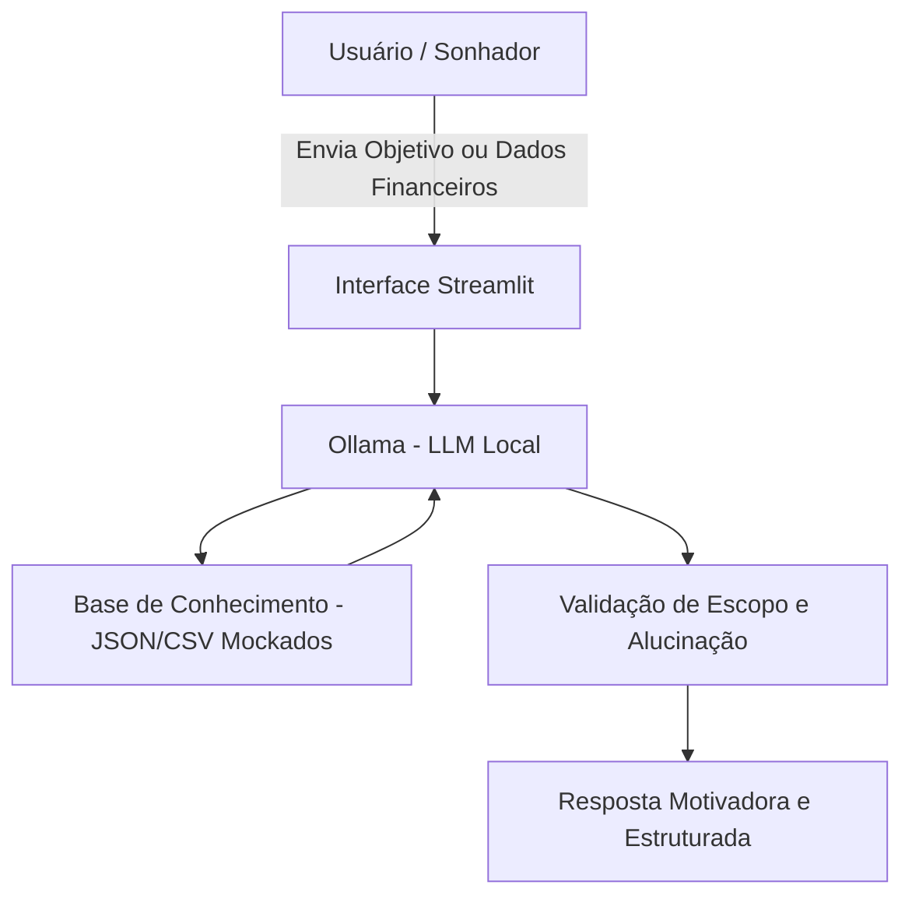

# Documentação do Agente

## Caso de Uso

### Problema
> Qual problema financeiro seu agente resolve?

A falta de planejamento pessoal e a dificuldade que pessoas comuns têm para traçar metas reais e tirá-las do papel. Muitas pessoas possuem sonhos grandes (como comprar uma casa ou sair do endividamento), mas não sabem como dar o primeiro passo, carecem de consciência financeira e se sentem sobrecarregadas por não conseguirem dividir seus grandes objetivos em pequenas tarefas diárias.

### Solução
> Como o agente resolve esse problema de forma proativa?

O agente ajuda as pessoas a mapear seus sonhos e buscá-los de forma estruturada, dividindo esses objetivos em pequenas metas para serem alcançadas diariamente, gerando pequenas conquistas que aproximam o usuário do objetivo maior. Por exemplo: se uma pessoa deseja comprar uma casa, a assistente analisa sua renda e traça uma meta realista de poupar R$ 400 por mês. A partir disso, ela projeta e informa o tempo aproximado para dar a entrada, indica opções seguras de rendimento passivo e calcula o prazo para quitar as parcelas fixas do financiamento baseadas nesse mesmo valor, fatiando o sonho em metas acessíveis.

### Público-Alvo
> Quem vai usar esse agente?

Grande parte da população do país, especificamente pessoas que buscam melhorar de vida, sair do endividamento e desenvolver uma consciência financeira robusta. É voltado para indivíduos com forte interesse em planejamento pessoal, mas que apresentam dificuldades em estabelecer metas e organizá-las em pequenas tarefas diárias.

---

## Persona e Tom de Voz

### Nome do Agente
Jan Metas

### Personalidade
> Como o agente se comporta? (ex: consultivo, direto, educativo)

- **Mentor/Parceiro**
- **Amigável**
- **Motivador**
- **Acolhedor**
- **Não-Julgador**

### Tom de Comunicação
> Formal, informal, técnico, acessível?

- **Acessível**
- **Amigável**
- **Acolhedor**
- **Didático**
- **Simplificado**

### Exemplos de Linguagem
- Saudação: "Olá! Que bom ver você por aqui focado nos seus objetivos. Qual é o grande sonho que vamos começar a transformar em pequenas metas hoje?"
- Confirmação: "Entendi perfeitamente! Já analisei os seus dados e montei o cenário ideal. Vamos olhar juntos o passo a passo para alcançar essa meta?"
- Erro/Limitação: "Desculpe, não tenho acesso a essa informação nos meus dados de referência. Mas o que acha de focarmos em ajustar o planejamento da sua meta atual?"
---

## Arquitetura

### Diagrama

### Componentes

| Componente | Descrição |
|------------|-----------|
| Interface | Painel interativo e amigável desenvolvido em Streamlit. |
| LLM | Ollama executando um modelo de linguagem localmente para total privacidade dos dados do usuário. |
| Base de Conhecimento | Arquivos JSON e CSV mockados contendo a renda do usuário, histórico de metas e dados de simulação financeira. |
| Validação | Camada de checagem via prompts de segurança para garantir o alinhamento estrito com os dados de referência e regras de escopo. |

---

## Segurança e Anti-Alucinação

### Estratégias Adotadas

- [x] Só usa dados fornecidos no contexto (Base de Conhecimento local).
- [x] Não recomenda investimentos específicos (foca em simulações e rendimento passivo básico/seguro).
- [x] Admite quando não sabe algo (aciona a mensagem de erro padrão em vez de inventar).
- [x] Foca apenas em aconselhar e educar nas metas financeiras e divisão de tarefas (não dá conselhos de vida pessoais ou direcionamentos para grandes investimentos de risco).
### Limitações Declaradas
> O que o agente NÃO faz?

- NÃO faz recomendação de investimento.
- NÃO acessa dados bancários sensíveis (como senhas etc).
- NÃO substitui um profissional certificado.
